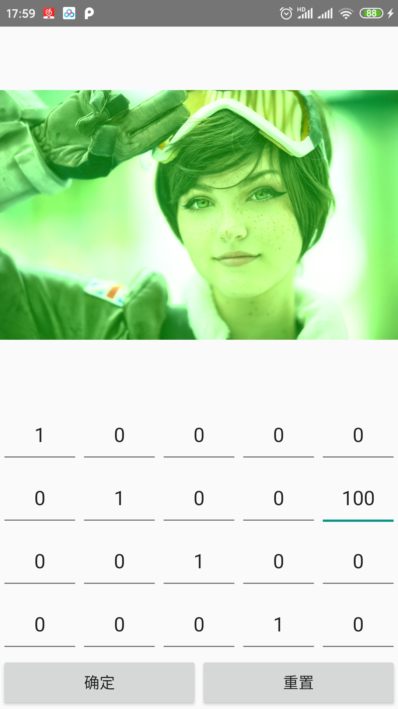

# BITKindergarten

## ## 功能

图像简单滤镜添加

主页面前面三个为图像矩阵演示，最后一个是实际滤镜功能

## 2020年1月Bytedance竞技赛参赛

进度：

​	权限申请、选择图片、添加滤镜等功能正常运行

未实现：

​	没有解决保存功能

---

## 2020.4.11BIT第17届挑战杯

进度：

保存功能已解决

解决方法以及之前只能保存原始图片问题的原因:

​	**需要新建bitmap对象，然后使用最后的ColorMatrix矩阵给新建paint加上滤镜，然后将这个paint利用Canvas画给bitmap，这样才能获取到修改之后的bitmap。如果只是加滤镜，那么不会改bitmap本身**

## 演示：

### 视频

<video id="video" controls="" preload="none">
    <source id="mp4" src="./mdsrc/RecorderForPresentation.mp4" type="video/mp4">
</video>

（md加入本地视频参考原文链接：https://blog.csdn.net/l1216766050/article/details/88962973）

### 矩阵修图

**声名：**

​	**此次更改是为了作为BIT第17届挑战杯参赛作品，本第一作者及小组成员将保留一切权利**

后期预想：

​	功能整合，去糟求精

​	添加Lottie动画、分享功能