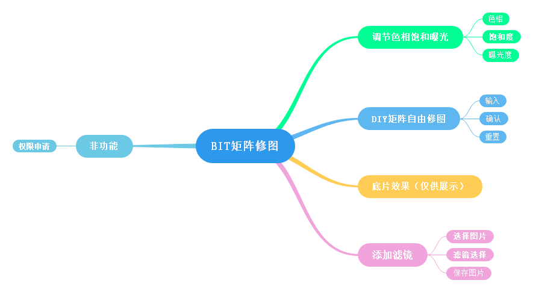
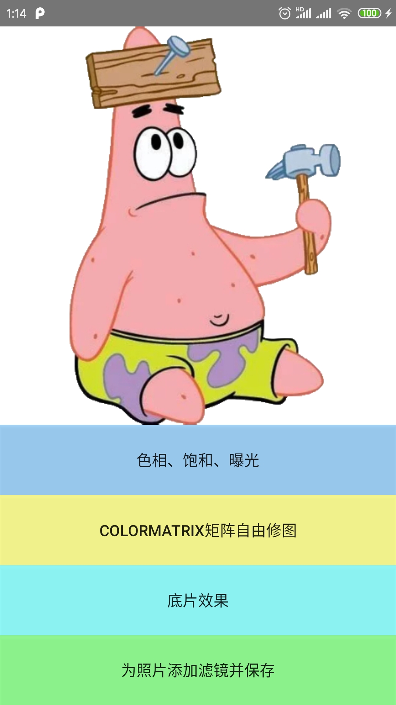
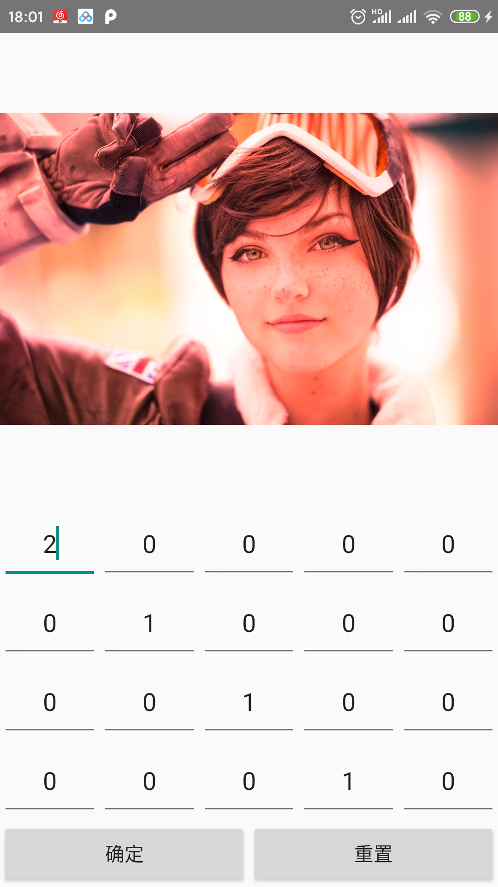
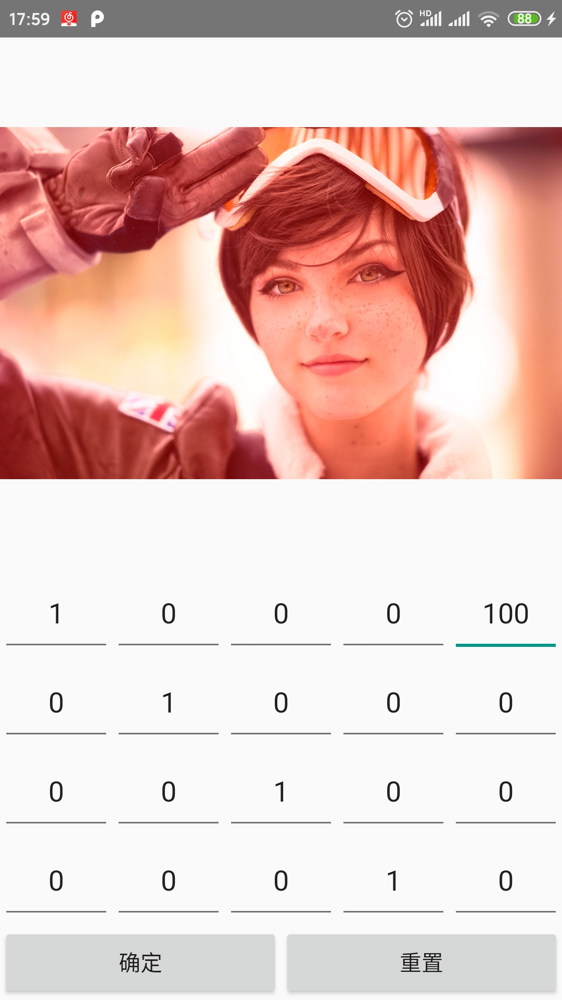
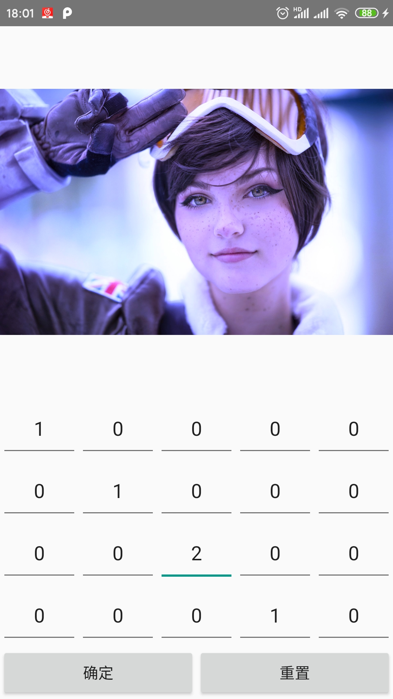
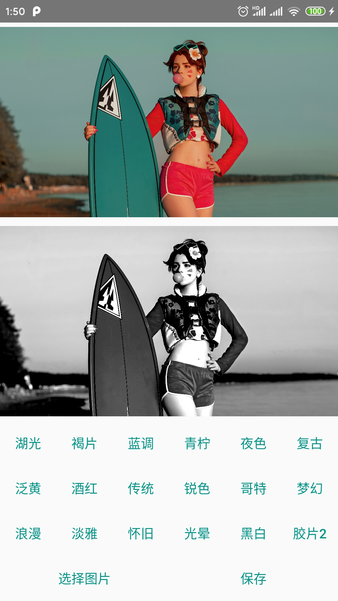

# BITKindergarten

## ## 功能

图像简单滤镜添加

主页面前面三个为图像矩阵演示，最后一个是实际滤镜功能

## 2020年1月Bytedance竞技赛参赛

进度：

​	权限申请、选择图片、添加滤镜等功能正常运行

未实现：

​	没有解决保存功能

---

## 2020.4.11BIT第17届挑战杯

进度：

保存功能已解决

解决方法以及之前只能保存原始图片问题的原因:

​	**需要新建bitmap对象，然后使用最后的ColorMatrix矩阵给新建paint加上滤镜，然后将这个paint利用Canvas画给bitmap，这样才能获取到修改之后的bitmap。如果只是加滤镜，那么不会改bitmap本身**

## 演示：

### 视频（Typora有且可以播放，github么有，视频在./mdsrc/下）

<video id="video" controls="" preload="none">
    <source id="mp4" src="./mdsrc/RecorderForPresentation.mp4" type="video/mp4">
</video>

（md加入本地视频参考原文链接：https://blog.csdn.net/l1216766050/article/details/88962973）

### 矩阵修图

**声名：**

​	**此次更改是为了作为BIT第17届挑战杯参赛作品，本第一作者及小组成员将保留一切权利**

后期可发展的预想：

​	功能整合，去糟求精，界面优化

​	添加Lottie动画

​	添加拍照功能，搭配滤镜

​	丰富滤镜种类，如雾化、背景虚化、去红眼、痕迹修复、运动模糊修复

​	添加裁剪、缩放、添加文字、表情、相框、马赛克、涂改标注等功能

​	添加图片识别功能，提取文字或者数字（如车牌号），添加人脸识别

​	添加特效制作如图片动漫化、短视频、定格动画、GIF制作

​	添加社交分享功能（拉取其他平台或者自建服务器）

2020.10.24（程序员节哟）
想要加一个负片功能，也就是反相
加个矩阵在最后一页会很方便
但是如果在第二页加个选择图片保存会更加具有适应性，虽然难用了点
写到一半需要测试（很久没看代码生疏了），发现没有笔记本插口不够了，我是不是需要一个扩展坞
等这阵忙过去了买个扩展坞继续做
